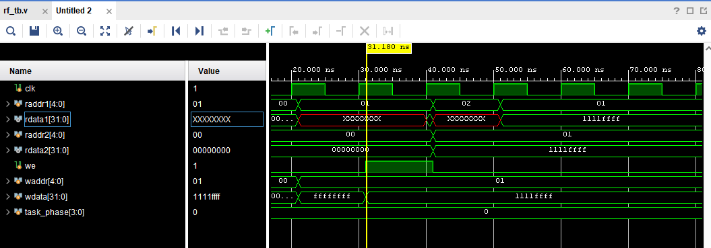
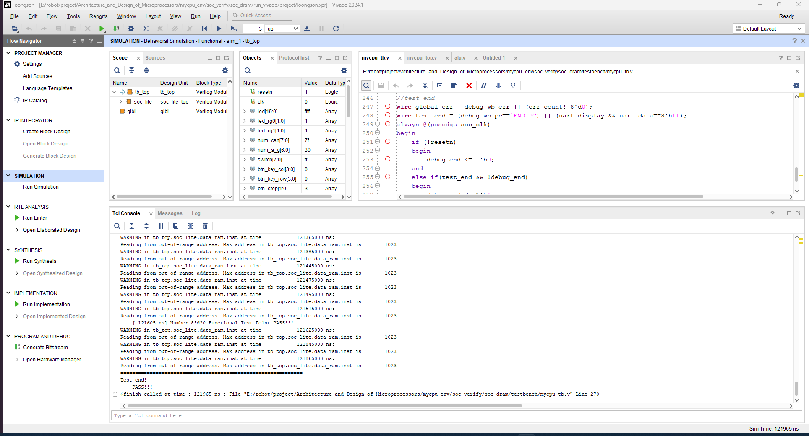

- [主要参考](#主要参考)
- [实验结果](#实验结果)
	- [exp1](#exp1)
	- [exp2](#exp2)
	- [exp3](#exp3)
		- [同步RAM](#同步ram)
		- [异步RAM](#异步ram)
	- [exp4](#exp4)
	- [单周期CPU设计](#单周期cpu设计)
		- [5条指令单周期CPU](#5条指令单周期cpu)
		- [20条指令单周期CPU](#20条指令单周期cpu)

# 主要参考
[龙芯设计](https://bookdown.org/loongson/_book3/)<br>
[lab仓库](https://gitee.com/loongson-edu/cdp_ede_local)<br>
软件环境: vivado 24.1 <br>
# 实验结果
有些实验用的是龙芯自己的实验箱，所以很多exp只跑了仿真部分。
## exp1

<p align="center">

</p>
<p align = "center">
<i>exp1仿真 200ns reset 高电平</i>
</p>

## exp2
exp2的仿真主要分为三个部分，下面逐一讲解<br>
`part0`
```verilog
// Part 0 Begin
	#10;
	task_phase = 4'd0;
	we         = 1'b0;
	waddr      = 5'd1;
	wdata      = 32'hffffffff;
    raddr1     = 5'd1;
    #10;
	we         = 1'b1;
	waddr      = 5'd1;
	wdata      = 32'h1111ffff;
    #10;
	we         = 1'b0;
    raddr1     = 5'd2;
    raddr2     = 5'd1;
	#10;
    raddr1     = 5'd1;
```
第一部分：`we`(write enable)没有使能，写入`wdata`是没有作用的（后面可以验证看到）<br>
第二部分：`we`使能同时吸入`wdata`，（此时特意设置和第一部分不同验证使能的效果）<br>
第三部分：`we`没有使能，读取`raddr1`的值，可以发现是第二部分`we`使能后写入的数据（验证了使能效果）<br>
第四部分：读取`raddr2`的值，可以发现是`raddr1`的值（验证了另一个读寄存器的效果）<br>
<p align="center">

</p>
<p align = "center">
<i>part_0部分仿真</i>
</p>

`part1`
```verilog
    #10;
	task_phase = 4'd1;
	we         = 1'b1;
	wdata      = 32'h0000ffff;
	waddr      =  5'h10;
    raddr1     =  5'h10;
    raddr2     =  5'h0f;
	#10;
	wdata      = 32'h1111ffff;
	waddr      =  5'h11;
    raddr1     =  5'h11;
    raddr2     =  5'h10;
	#10;
	wdata      = 32'h2222ffff;
	waddr      =  5'h12;
    raddr1     =  5'h12;
    raddr2     =  5'h11;
	#10;
	wdata      = 32'h3333ffff;
	waddr      =  5'h13;
    raddr1     =  5'h13;
    raddr2     =  5'h12;
	#10;
	wdata      = 32'h4444ffff;
	waddr      =  5'h14;
    raddr1     =  5'h14;
    raddr2     =  5'h13;
	#10;
    raddr1     =  5'h15;
    raddr2     =  5'h14;
	#10;
```
这个部分主要仿真的部分是写入寄存器后需要在下一个周期进行读取。<br>
主要讲解两个部分，剩下的是一样的。<br>
第一部分：进入`part1`部分仿真（注意`task_phase`的值），`we`使能同时向`h10`地址写入数据，此时两个寄存器读取地址`h10`和`h0f`都是无法读取到数值的。<br>
第二部分：向`h11`写入值，同时`raddr1`读取`h11`的值，`raddr2`读取`h10`的值，可以看到`raddr2`读取的是上一个周期的值（也就是第一部分写入的值），`raddr1`读取的是这个周期的值（因为这个周期正在写入所以没有值）。<br>
后续都是一样的，验证本周期完成写入的时候下一个周期才能读取到数据。<br>
<p align="center">

</p>
<p align = "center">
<i>part_1部分仿真</i>
</p>

`part3`
```verilog
	#10;
	task_phase = 4'd2;
	we         = 1'b1;
    raddr1     =  5'h10;
    raddr2     =  5'h0f;
	#10;
    raddr1     =  5'h11;
    raddr2     =  5'h10;
	#10;
    raddr1     =  5'h12;
    raddr2     =  5'h11;
	#10;
    raddr1     =  5'h13;
    raddr2     =  5'h12;
	#10;
    raddr1     =  5'h14;
    raddr2     =  5'h13;
	#10;
```
`part3`验证的是前面写入的值读取，不需要过多讲解，就是直接设置`radd1`和`radd2`读取对应的值。<br>
<p align="center">

</p>
<p align = "center">
<i>part_2部分仿真</i>
</p>

## exp3
这里分为三个部分，分别为同步RAM、异步RAM、对比两种RAM。<br>
- [ ] 综合和实现后的时序结果与资源利用效率分析<br>
不确定是芯片信号选择问题或者别的问题，implementation会报错设计为空，因为不是主要关注的部分，暂时选择不管。
```
[Place 30-494] The design is empty
Resolution: Check if opt_design has removed all the leaf cells of your design.  Check whether you have instantiated and connected all of the top level ports.
[Common 17-69] Command failed: Placer could not place all instances
```

### 同步RAM

`part0`
```verilog
	// Part 0 Begin
	#10;
	task_phase = 4'd0;
	ram_wen    = 1'b0;
	ram_addr   = 16'hf0;
	ram_wdata  = 32'hffffffff;
    #10;
	ram_wen    = 1'b1;
	ram_addr   = 16'hf0;
	ram_wdata  = 32'h11223344;
    #10;
	ram_wen    = 1'b0;
	ram_addr   = 16'hf1;
	#10;
	ram_wen    = 1'b0;
	ram_addr   = 16'hf0;
```
这里可以分为四个部分，主要是体现同步RAM的特性。<br>
第一部分：`ram_wen`没有使能，写入`ram_wdata`是没有作用的（后面可以验证看到）<br>
第二部分：`ram_wen`使能同时写入`ram_wdata`，（此时特意设置和第一部分不同验证使能的效果）<br>
第三部分：`ram_wen`没有使能，读取`ram_addr=f1`的值，可以发现是第二部分`ram_wen`使能后写入的数据（验证了同步RAM的数据在下一个周期）<br>
第四部分：读取`ram_addr=f0`的值，在这个周期可以发现是`ram_addr=f1`的值（全为0），下一个周期开始才是f0的值<br>
<p align="center">

</p>
<p align = "center">
<i>part_0部分仿真</i>
</p>

`part1`
```verilog
    // Part 1 Begin
    #10;
	task_phase = 4'd1;
	ram_wen    = 1'b1;
	ram_wdata  = 32'hff00;
	ram_addr   = 16'hf0;
	#10;
	ram_wdata  = 32'hff11;
	ram_addr   = 16'hf1;
	#10;
	ram_wdata  = 32'hff22;
	ram_addr   = 16'hf2;
	#10;
	ram_wdata  = 32'hff33;
	ram_addr   = 16'hf3;
	#10;
	ram_wdata  = 32'hff44;
	ram_addr   = 16'hf4;
	#10;
```
这个部分把使能打开，验证同步RAM的读操作读取的是上一个周期状态的数据<br>
以这里的以第一部分举例，看到我们对`f0`写入了`0000ff00`但是这个周期读出的数据仍然是之前的`11223344`，后一个周期读取的才是`00000ff00`<br>
后续的部分同理，自行查看理解即可。<br>
<p align="center">

</p>
<p align = "center">
<i>part_1部分仿真</i>
</p>

`part2`
```verilog
	// Part 2 Begin
	#10;
	task_phase = 4'd2;
	ram_wen    = 1'b0;
	ram_addr   = 16'hf0;
	ram_wdata  = 32'hffffffff;
	#10;
	ram_addr   = 16'hf1;
	#10;
	ram_addr   = 16'hf2;
	#10;
	ram_addr   = 16'hf3;
	#10;
	ram_addr   = 16'hf4;
	#10;
```
这部分和前面的寄存器相似，读取验证一下RAM里面的数据<br>
<p align="center">

</p>
<p align = "center">
<i>part_2部分仿真</i>
</p>

### 异步RAM
这里和上面的内容测试代码完全一样所以我们只贴出最后的仿真结果<br>
同时大概讲一下异步的RAM不一样的点在哪，后续会分析两者的时序结果与资源效率分析<br>
`part0`
可以看到这里在`fo`写入之后周期的末尾`rdata`更新了一次数据，后面的读取就能做到读取的就是当前周期的值而不是下一个周期的值<br>
比如同步RAM中在写入后，读取输入`f0`地址，`rdata`的值就要在下一个周期才会更新，但是异步RAM的写入最后会直接”同步一次“`rdata`的数据，后续能做到读取“本周期的数据”<br>
<p align="center">

</p>
<p align = "center">
<i>part_0部分仿真</i>
</p>

`part1`
可以看到这里在每个写入之后，周期末尾都会”同步最新值“，也就是能做到本周期读取本周期的值。<br>
<p align="center">

</p>
<p align = "center">
<i>part_1部分仿真</i>
</p>

`part2`
这里就是同周期对应同周期，而不用到下一个周期。<br>
<p align="center">

</p>
<p align = "center">
<i>part_2部分仿真</i>
</p>

## exp4
没有板子没办法上班，原始的`tb.v`是只有按键设置的，和提到的可能有bug的功能无关，因为不是课程主要的部分，所以选择先这样了。<br>
<p align="center">

</p>
<p align = "center">
<i>part_2部分仿真</i>
</p>

## 单周期CPU设计
### 5条指令单周期CPU
这里使用的仓库故意留空了，让我们自己填写。<br>
询问GPT得到了答案 + 仿真成功（前提是要自己手动去升级IP核心，具体可以搜索或者看我的[另一个仓库](https://github.com/nightt5879/FPGA?tab=readme-ov-file#34-%E5%AE%9E%E9%AA%8C-4)里面的Zedboard实验4部分的操作）<br>
- [ ] 验证讲解单周期CPU的原理
答案：（全都在minicpu_top.v里面）<br>
```verilog
// 对应 SW 存储指令
assign inst_st_w   = op_31_26_d[6'h2b] & op_25_22_d[4'h2];//在这里实现inst_st_w指令的译码

// 如果是 ADDI 指令，则选择立即数
assign src2_is_imm   = inst_addi_w;//在这里实现立即数选择信号
PP
// 将 16 位立即数符号扩展为 32 位
assign br_offs   = {{16{i16[15]}}, i16};//在这里完成br_offs信号的生成

// 如果分支成立，跳转到目标地址，否则顺序执行
assign nextpc    = br_taken ? br_target : pc + 4;//在这里实现nextpc信号的生成

// 如果是立即数，则使用立即数，否则使用寄存器的值
assign alu_src2 = src2_is_imm ? imm : rkd_value;//在这里实现alu_src2信号

// 如果是加载指令，使用从内存读取的数据；否则使用 ALU 结果
assign rf_wdata = res_from_mem ? data_sram_rdata : alu_result;//在这里完成写回寄存器值的选择
```

### 20条指令单周期CPU
这里的错误相对较多，主要感谢CSDN的[这篇文章](https://blog.csdn.net/weixin_46191137/article/details/134101452)<br>
这里也简单的使用compare tool来大概说明一下大概的错误有哪些部分。<br>
先贴一个运行的结果（可以直接替换两个v文件+更改一点alu.v的问题）<br>
<p align="center">

</p>
<p align = "center">
<i>成功运行</i>
</p>

`alu.v`的问题：<br>
```verilog
// line 74
// before change: assign or_result  = alu_src1 | alu_src2 | alu_result;
assign or_result  = alu_src1 | alu_src2;
// line 83-85
//before change:assign sr64_result = {{32{op_sra & alu_src2[31]}}, alu_src2[31:0]} >> alu_src1[4:0]; //rj >> i5
assign sr64_result = {{32{op_sra & alu_src1[31]}}, alu_src1[31:0]} >> alu_src2[4:0]; //rj >> i5

//before change:assign sr_result   = sr64_result[30:0];
assign sr_result   = sr64_result[31:0];
```
这里主要问题在`alu_src1`和`alu_src2`。这两个都是32位的输入信号，是两个操作数。<br>
所以第一个的问题就比较显而易见了，`or`操作是两个32位的操作数使用`\`操作符号，而不是包括了`alu_result`的`or`操作。<br>
第二个的错误在于移位操作写反了`alu_src1`和`alu_src2`，在CPU设计中，通常以第二个操作数作为移位的位数。<br>
第三个的问题比较简单，32位宽度的操作数是[31:0]而不是[30:0]<br>

`mycpu_top.v`的问题：<br>
```verilog
// line 113 add code
wire [31:0] final_result;
//line 195
/*
before change:
assign imm = src2_is_4 ? 32'h4                      :
             need_si20 ? {i20[19:0], 12'b0}         :
//need_ui5 || need_si12{{20{i12[11]}}, i12[11:0]} ;
*/
assign imm = src2_is_4 ? 32'h4                      :
             need_si20 ? {i20[19:0], 12'b0}         :
             need_ui5  ? rk                         :
            /*need_si12*/{{20{i12[11]}}, i12[11:0]} ;
//line 218
// before change: assign gr_we         = ~inst_st_w & ~inst_beq & ~inst_bne & ~inst_b & ~inst_bl;
assign gr_we         = ~inst_st_w & ~inst_beq & ~inst_bne & ~inst_b;
//line 248
//before change: assign alu_src1 = src1_is_pc  ? pc[31:0] : rj_value;
assign alu_src1 = src1_is_pc  ? pc : rj_value;
//line 251
/*
before change
alu u_alu(
    .alu_op     (alu_op    ),
    .alu_src1   (alu_src2  ),
    .alu_src2   (alu_src2  ),
    .alu_result (alu_result)
    );
*/
alu u_alu(
    .alu_op     (alu_op    ),
    .alu_src1   (alu_src1  ),
    .alu_src2   (alu_src2  ),
    .alu_result (alu_result)
    );
// line 271
// before change: assign debug_wb_rf_wen   = {4{rf_we}};
assign debug_wb_rf_we    = {4{rf_we}};
```
第一个问题：没定义`final_result`，补全32的位的输入定义即可。<br>
第二个问题：少定义了`need_u15`作为立即数rk的选择信号。<br>
第三个问题：`inst_bl`并不参与寄存器写入，所以不应该在`gr_we`中。<br>
第四个问题：写完整的`pc[31:0]`应该也是可以的，但是使用`pc`足够了。<br>
第五、六个问题：主要都是tpyo，一个`alu_src12`写错了，一个是`debug_wb_rf_we`写错了。<br>